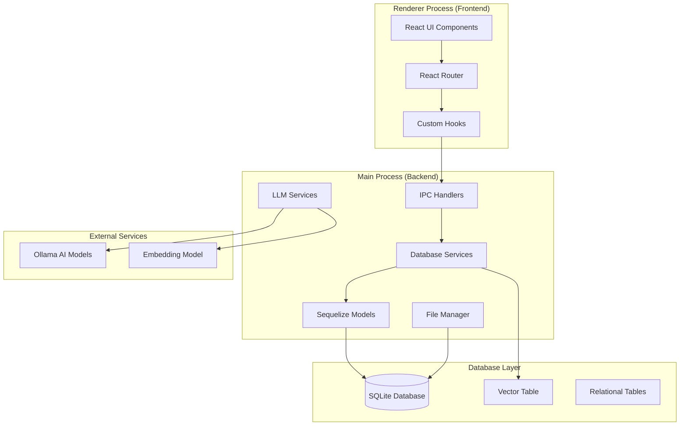
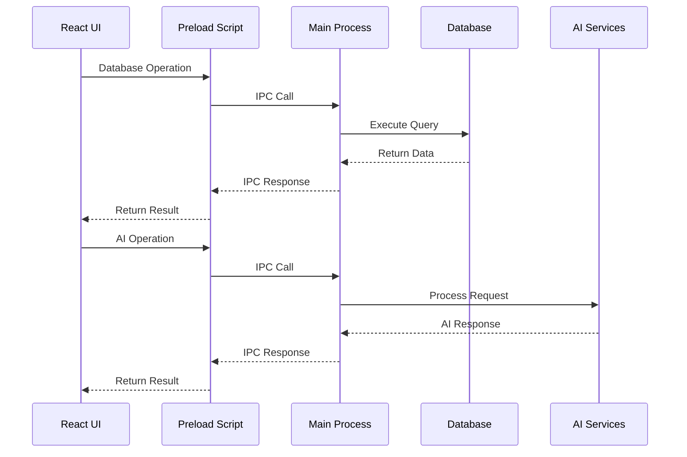
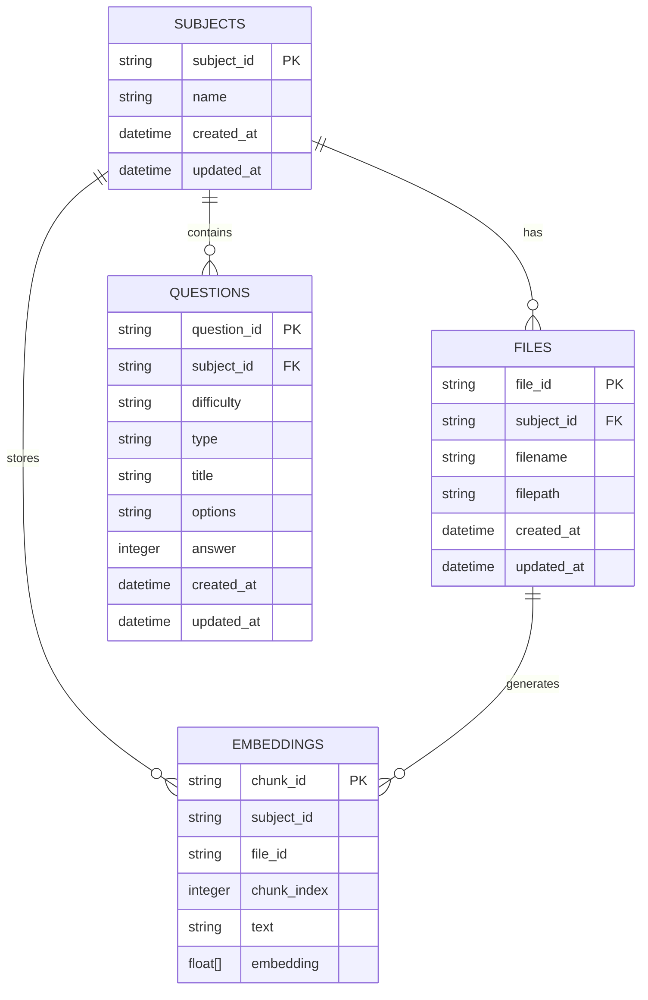
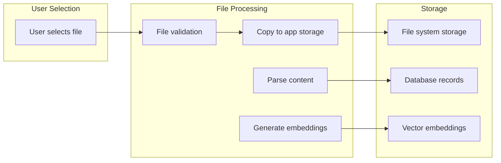
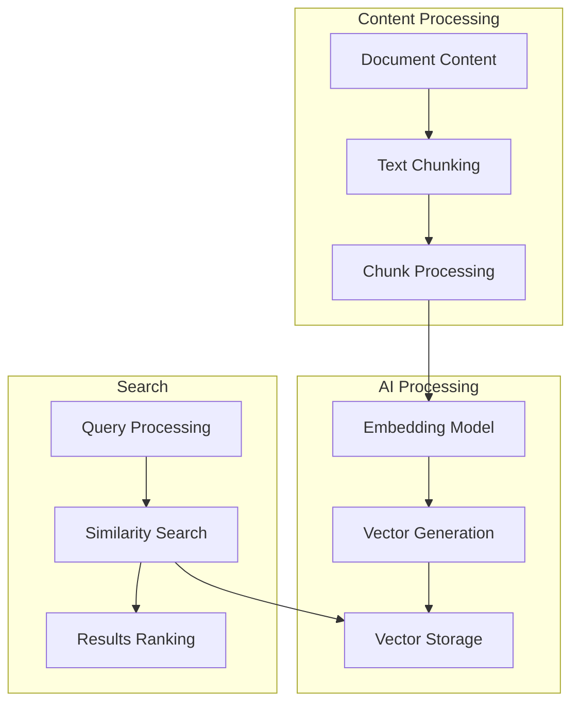
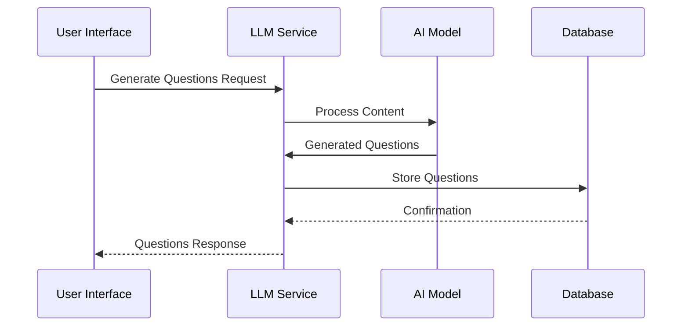

# Saidia - AI Teacher's Assistant

## Table of Contents

1. [Overview](#overview)
2. [Architecture](#architecture)
3. [Installation & Setup](#installation--setup)
4. [Database System](#database-system)
5. [API Reference](#api-reference)
6. [File Management](#file-management)
7. [Vector Embeddings](#vector-embeddings)
8. [Question Generation](#question-generation)
9. [Development Guide](#development-guide)
10. [Deployment](#deployment)

## Overview

Saidia is an AI-powered Teacher's Assistant built with Electron, designed to help educators with lesson planning, content organization, and automated question generation. The application provides a comprehensive platform for managing educational content with advanced AI capabilities.

### Key Features

- 📚 **Subject Management**: Organize educational content by subjects
- 📄 **Multi-format File Support**: PDF, DOCX, TXT, MD, and image files
- 🤖 **AI Question Generation**: Automatically generate questions from content
- 🔍 **Vector Search**: Semantic search through document content
- 📊 **Question Bank**: Store and manage generated questions
- 🎯 **Difficulty Levels**: Easy, Medium, Hard question categorization
- 🔄 **Cross-platform**: Windows, macOS, and Linux support

### Technology Stack

```
Frontend:
├── React 19.0.0
├── TypeScript 5.8.2
├── Mantine UI 8.1.2
├── StyleX 0.14.1
└── React Router 7.3.0

Backend:
├── Electron 35.7.0
├── Node.js 14+
├── SQLite with sqlite-vec
├── Better-sqlite3
└── Sequelize ORM

AI/ML:
├── Ollama Integration
├── Nomic Embed Text v1.5
├── Gemma3 Models
└── Vector Embeddings (384-dim)
```

## Architecture

### High-Level Architecture



### Process Communication



## Installation & Setup

### Prerequisites

- Node.js 14.x or higher
- npm 7.x or higher
- Git

### Development Setup

```bash
# Clone the repository
git clone <repository-url>
cd Saidia

# Install dependencies
npm install

# Start development server
npm start
```

### Production Build

```bash
# Build for current platform
npm run package

# Build for specific platform
npm run build
```

### Environment Configuration

The application uses the following environment variables:

```bash
NODE_ENV=development|production
DEBUG_PROD=true|false
START_MINIMIZED=true|false
```

## Database System

### Schema Overview



### Database Tables

#### 1. Subjects Table

```sql
CREATE TABLE subjects (
    subject_id   TEXT PRIMARY KEY,
    name         TEXT NOT NULL,
    created_at   DATETIME DEFAULT CURRENT_TIMESTAMP,
    updated_at   DATETIME DEFAULT CURRENT_TIMESTAMP
);
```

#### 2. Files Table

```sql
CREATE TABLE files (
    file_id      TEXT PRIMARY KEY,
    subject_id   TEXT NOT NULL REFERENCES subjects(subject_id),
    filename     TEXT NOT NULL,
    filepath     TEXT NOT NULL,
    created_at   DATETIME DEFAULT CURRENT_TIMESTAMP,
    updated_at   DATETIME DEFAULT CURRENT_TIMESTAMP
);
```

#### 3. Questions Table

```sql
CREATE TABLE questions (
    question_id    TEXT PRIMARY KEY,
    subject_id     TEXT NOT NULL REFERENCES subjects(subject_id),
    difficulty     TEXT CHECK (difficulty IN ('easy', 'medium', 'hard')),
    type           TEXT CHECK (type IN ('multiple_choice', 'true_false', 'fill_in_the_blank')),
    title          TEXT NOT NULL,
    options        TEXT, -- JSON string for multiple choice options
    answer         INTEGER, -- Index for correct answer
    created_at     DATETIME DEFAULT CURRENT_TIMESTAMP,
    updated_at     DATETIME DEFAULT CURRENT_TIMESTAMP
);
```

#### 4. Embeddings Table (Virtual)

```sql
CREATE VIRTUAL TABLE embeddings USING vec0 (
    chunk_id     TEXT PRIMARY KEY,
    subject_id   TEXT,
    file_id      TEXT,
    chunk_index  INTEGER,
    text         TEXT,
    embedding    FLOAT[384]
);
```

### Database Operations

#### Subject Operations

```typescript
// Create a new subject
const result = await db.createSubject('Mathematics 101');

// Get all subjects
const subjects = await db.getSubjects();

// Get specific subject
const subject = await db.getSubject('math_101');

// Update subject
const updated = await db.updateSubject('math_101', { name: 'Advanced Math' });

// Delete subject (cascades to files, questions, embeddings)
const deleted = await db.deleteSubject('math_101');
```

#### File Operations

```typescript
// Create file record
const file = await db.createFile('math_101', 'algebra.pdf', '/path/to/file');

// Get files by subject
const files = await db.getFiles('math_101');

// Delete file
const deleted = await db.deleteFile('file_123');
```

#### Question Operations

```typescript
// Create question
const question = await db.createQuestion(
  'math_101',
  'medium',
  'multiple_choice',
  'What is 2 + 2?',
  ['2', '3', '4', '5'],
  2, // answer index
);

// Get questions by difficulty
const questions = await db.getQuestions('math_101', 'medium');
```

#### Embedding Operations

```typescript
// Add embedding
const embedding = await db.addEmbedding(
  'math_101',
  'file_123',
  'This is sample text content.',
  [0.1, 0.2, ...] // 384-dimensional vector
);

// Search similar content
const similar = await db.searchSimilar(queryEmbedding, 10, 'math_101');
```

## API Reference

### IPC Handlers

The application uses Electron's IPC (Inter-Process Communication) for secure communication between the renderer and main processes.

#### Subject Handlers

```typescript
// Events
'create-subject';
'get-subjects';
'get-subject';
'update-subject';
'delete-subject';

// Example usage
const result = await window.electronAPI.createSubject('Physics 101');
```

#### File Handlers

```typescript
// Events
'create-file';
'get-files';
'get-file';
'update-file';
'delete-file';
'delete-files-by-subject';

// Example usage
const result = await window.electronAPI.createFile(
  'physics_101',
  'mechanics.pdf',
  '/path/to/file',
);
```

#### Question Handlers

```typescript
// Events
'create-question';
'get-questions';
'get-question';
'update-question';
'delete-question';
'delete-questions-by-subject';

// Example usage
const result = await window.electronAPI.createQuestion(
  'physics_101',
  'medium',
  'multiple_choice',
  "What is Newton's first law?",
  ['Option A', 'Option B', 'Option C', 'Option D'],
  0,
);
```

#### Embedding Handlers

```typescript
// Events
'add-embedding';
'search-similar';
'get-embeddings-by-file';
'get-embeddings-by-subject';
'delete-embeddings-by-file';
'delete-embeddings-by-subject';

// Example usage
const result = await window.electronAPI.addEmbedding(
  'physics_101',
  'file_123',
  'Text content for embedding',
  embeddingVector,
);
```

### Response Types

All IPC handlers return a standardized response format:

```typescript
interface IPCResponse<T = any> {
  success: boolean;
  data?: T;
  error?: string;
}
```

#### Specific Response Types

```typescript
// Subject responses
interface SubjectResponse {
  subject_id: string;
  name: string;
  created_at?: Date;
  updated_at?: Date;
}

// File responses
interface FileResponse {
  file_id: string;
  subject_id: string;
  filename: string;
  filepath: string;
}

// Question responses
interface TQuestion {
  question_id: string;
  subject_id: string;
  difficulty: QuestionDifficulty;
  type: QuestionType;
  title: string;
  options?: string[];
  answer?: number;
  created_at: Date;
}

// Embedding responses
interface TEmbedding {
  chunk_id: string;
  subject_id: string;
  file_id: string;
  chunk_index: number;
  text: string;
  embedding: number[];
  distance?: number; // For search results
}
```

## File Management

### Supported File Types

```typescript
const FILE_EXTENSIONS = [
  'pdf', // PDF documents
  'doc', // Microsoft Word (legacy)
  'docx', // Microsoft Word
  'txt', // Plain text
  'md', // Markdown
  'jpg', // JPEG images
  'jpeg', // JPEG images
  'png', // PNG images
  'bmp', // Bitmap images
  'tiff', // TIFF images
  'webp', // WebP images
  'heic', // HEIC images
  'heif', // HEIF images
];
```

### File Storage Architecture



### File Storage Structure

```
{userData}/
├── data.db                    # SQLite database
└── files/                     # File storage directory
    ├── subject_001/           # Subject-specific folder
    │   ├── document_1234.pdf  # Stored files with unique names
    │   └── image_5678.jpg
    └── subject_002/
        └── notes_9012.txt
```

### File Processing Pipeline

1. **File Validation**: Check file type and size
2. **Storage**: Copy to app's secure storage directory
3. **Content Extraction**: Parse file content based on type
4. **Chunking**: Split content into manageable chunks
5. **Embedding Generation**: Create vector embeddings for each chunk
6. **Database Storage**: Store file metadata and embeddings

### Platform-Specific File Operations

The application includes platform-specific file deletion implementations:

```typescript
// Windows
const deleteFileWindows = async (filepath: string): Promise<boolean> => {
  try {
    await fs.promises.unlink(filepath);
    return true;
  } catch (error) {
    // Handle Windows-specific errors (EACCES, EPERM)
    return false;
  }
};

// macOS/Linux
const deleteFileUnix = async (filepath: string): Promise<boolean> => {
  try {
    await fs.promises.unlink(filepath);
    return true;
  } catch (error) {
    return false;
  }
};
```

## Vector Embeddings

### Embedding System Overview



### Embedding Configuration

```typescript
const CONFIG_MODELS = {
  EMBEDDING_MODEL: 'nomic-embed-text:v1.5',
  QUESTION_GENERATION_MODEL: 'gemma3:4b',
  VISION_MODEL: 'gemma3:4b',
};
```

### Vector Operations

#### Adding Embeddings

```typescript
// Generate embedding for text chunk
const embedding = await generateEmbedding(textChunk);

// Store in database
const result = await db.addEmbedding(subjectId, fileId, textChunk, embedding);
```

#### Similarity Search

```typescript
// Search for similar content
const results = await db.searchSimilar(
  queryEmbedding, // 384-dimensional vector
  10, // Limit results
  subjectId, // Optional subject filter
);

// Results include distance scores
results.forEach((result) => {
  console.log(`Text: ${result.text}`);
  console.log(`Similarity: ${1 - result.distance}`);
});
```

### Embedding Model Integration

The application integrates with Ollama for embedding generation:

```typescript
// Example embedding generation
const generateEmbedding = async (text: string): Promise<number[]> => {
  const response = await fetch('http://localhost:11434/api/embeddings', {
    method: 'POST',
    headers: { 'Content-Type': 'application/json' },
    body: JSON.stringify({
      model: 'nomic-embed-text:v1.5',
      prompt: text,
    }),
  });

  const result = await response.json();
  return result.embedding;
};
```

## Question Generation

### Question Types

```typescript
const QuestionType = {
  MULTIPLE_CHOICE: 'multiple_choice',
  TRUE_FALSE: 'true_false',
  FILL_IN_THE_BLANK: 'fill_in_the_blank',
} as const;

const QuestionDifficulty = {
  EASY: 'easy',
  MEDIUM: 'medium',
  HARD: 'hard',
} as const;
```

### Question Generation Process



### Question Generation API

```typescript
interface GenerateQuestionOptions {
  difficulty: QuestionDifficulty;
  count: number;
  type: QuestionType;
}

interface GenerateQuestionsResponse {
  question: string;
  choices?: string[];
  answer?: number;
}

// Example usage
const questions = await generateQuestions(content, {
  difficulty: 'medium',
  count: 5,
  type: 'multiple_choice',
});
```

### Question Storage Format

```typescript
// Multiple Choice Question
{
  question_id: 'q_123',
  subject_id: 'math_101',
  difficulty: 'medium',
  type: 'multiple_choice',
  title: 'What is the derivative of x²?',
  options: JSON.stringify(['x', '2x', 'x²', '2x²']),
  answer: 1 // Index of correct answer
}

// True/False Question
{
  question_id: 'q_124',
  subject_id: 'math_101',
  difficulty: 'easy',
  type: 'true_false',
  title: 'The derivative of a constant is zero.',
  options: JSON.stringify(['True', 'False']),
  answer: 0
}
```

## Development Guide

### Project Structure

```
src/
├── main/                    # Electron main process
│   ├── database/           # Database layer
│   │   ├── connection.ts   # Database connection
│   │   ├── models/         # Sequelize models
│   │   ├── services/       # Business logic
│   │   └── ipc-handlers/   # IPC handlers
│   ├── files/              # File management
│   ├── llm/                # AI/LLM services
│   └── main.ts             # Main process entry
├── renderer/               # React frontend
│   ├── components/         # React components
│   ├── hooks/              # Custom hooks
│   └── App.tsx             # Main app component
└── constants/              # Shared constants
    ├── types.ts            # TypeScript types
    ├── events.ts           # IPC events
    └── misc.ts             # Miscellaneous constants
```

### Development Workflow

1. **Database Changes**: Update models in `src/main/database/models/`
2. **Business Logic**: Add services in `src/main/database/services/`
3. **IPC Handlers**: Create handlers in `src/main/database/ipc-handlers/`
4. **Frontend**: Update React components and hooks
5. **Testing**: Use the DatabaseDemo component for testing

### Code Style

- **TypeScript**: Strict type checking enabled
- **ESLint**: Airbnb configuration with custom rules
- **Prettier**: Consistent code formatting
- **Naming**: camelCase for variables, PascalCase for components

### Testing

```bash
# Run tests
npm test

# Run tests with coverage
npm run test:coverage

# Run specific test file
npm test -- --testPathPattern=database
```

### Debugging

```bash
# Start with debugging
npm run start:debug

# View logs
tail -f ~/.config/Saidia/logs/main.log
```

## Deployment

### Build Configuration

The application uses Electron Builder for packaging:

```json
{
  "build": {
    "productName": "Saidia",
    "appId": "org.saidia.app",
    "asar": true,
    "files": ["dist", "node_modules", "package.json"],
    "mac": {
      "target": "dmg",
      "hardenedRuntime": true
    },
    "win": {
      "target": "nsis"
    },
    "linux": {
      "target": "AppImage"
    }
  }
}
```

### Platform-Specific Builds

```bash
# Build for macOS
npm run build:mac

# Build for Windows
npm run build:win

# Build for Linux
npm run build:linux

# Build for all platforms
npm run build:all
```

### Distribution

1. **Code Signing**: Configure certificates for macOS and Windows
2. **Notarization**: Set up Apple notarization for macOS
3. **Auto-updates**: Configure electron-updater
4. **Release**: Create GitHub releases with built artifacts

### Performance Optimization

- **Database**: Use indexes for frequently queried columns
- **Embeddings**: Batch embedding operations
- **File Processing**: Implement streaming for large files
- **Memory**: Monitor memory usage in development

### Security Considerations

- **File Access**: All file operations in main process
- **IPC Security**: Validate all IPC messages
- **Database**: Use parameterized queries
- **Updates**: Verify update signatures

---

## Contributing

1. Fork the repository
2. Create a feature branch
3. Make your changes
4. Add tests if applicable
5. Submit a pull request

## License

This project is licensed under the MIT License - see the LICENSE file for details.

## Support

For support and questions:

- Create an issue on GitHub
- Check the documentation
- Review the code examples

---

_Last updated: December 2024_
