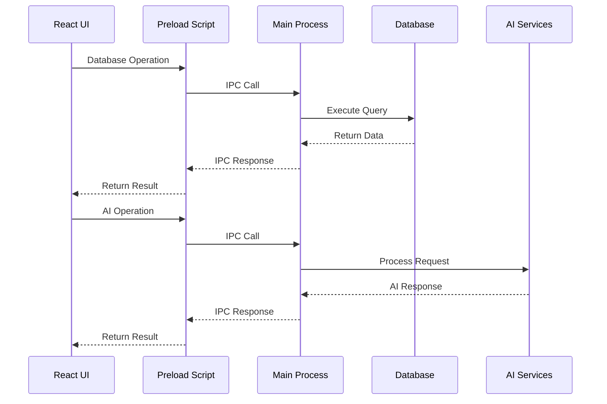

# Backend Architecture

## Overview

The backend of Saidia is built on Electron's main process, providing secure access to system resources and managing the application's core functionality.

## Technology Stack

### Core Technologies

- **Electron 35.7.0** - Cross-platform desktop framework
- **Node.js 14+** - JavaScript runtime
- **TypeScript 5.8.2** - Type-safe development

### Database Layer

- **SQLite** - Lightweight database
- **sqlite-vec** - Vector similarity search
- **Better-sqlite3** - High-performance SQLite driver
- **Sequelize ORM** - Database abstraction layer

### AI/ML Integration

- **Ollama Integration** - Local AI model processing
- **Nomic Embed Text v1.5** - Text embedding model
- **Gemma3 Models** - Question generation and processing
- **Vector Embeddings** - 384-dimensional semantic vectors

## Architecture Components

### Main Process Structure

```
src/main/
├── main.ts                 # Application entry point
├── menu.ts                 # Application menu
├── preload.ts              # Preload script
├── util.ts                 # Utility functions
├── setup-ipc-handlers.ts   # IPC handler setup
├── database/               # Database layer
│   ├── connection.ts       # Database connection
│   ├── models/             # Sequelize models
│   ├── services/           # Business logic
│   └── ipc-handlers/       # IPC handlers
├── files/                  # File management
│   ├── file-manager.ts     # File operations
│   ├── ipc-handlers.ts     # File IPC handlers
│   └── parse-*.ts          # File parsers
└── llm/                    # AI/LLM services
    ├── services.ts         # LLM service layer
    ├── ipc-handlers.ts     # LLM IPC handlers
    └── prompts.ts          # AI prompts
```

### Process Communication



## Key Services

### Database Services

- **SubjectService** - Subject management operations
- **FileService** - File metadata and storage operations
- **QuestionService** - Question CRUD operations
- **EmbeddingService** - Vector embedding operations

### File Management

- **FileManager** - File system operations
- **Platform-specific handlers** - Windows, macOS, Linux file operations
- **File parsers** - PDF, DOCX, TXT, MD, image processing

### AI Services

- **LLM Service** - Question generation
- **Embedding Service** - Vector generation and search
- **Prompt Management** - AI prompt templates

## Security Considerations

- **File Access**: All file operations handled in main process
- **IPC Security**: Message validation and sanitization
- **Database**: Parameterized queries to prevent injection
- **Updates**: Signature verification for auto-updates

## Performance Optimization

- **Database Indexing**: Optimized queries with proper indexes
- **Embedding Batching**: Batch operations for vector processing
- **File Streaming**: Efficient handling of large files
- **Memory Management**: Proper cleanup and resource management

---

[← Back to Home](Home) | [Frontend Architecture →](Frontend-Architecture)
