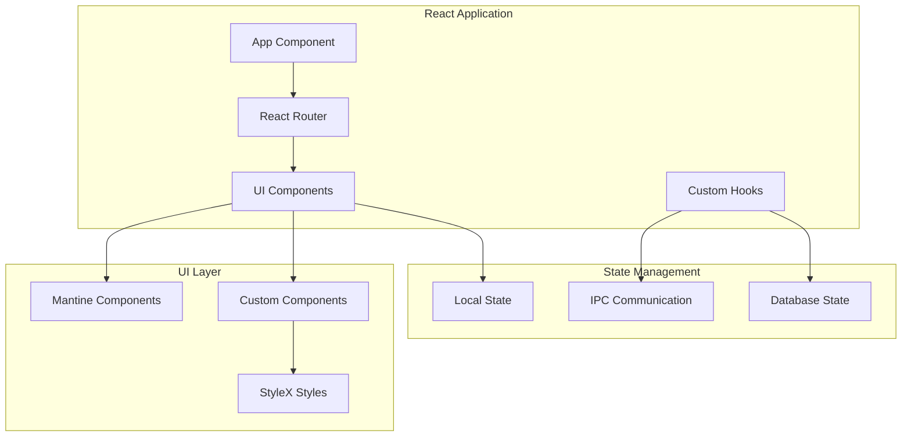

# Frontend Architecture

## Overview

The frontend of Saidia is built with React and TypeScript, providing a modern, responsive user interface for educational content management.

## Technology Stack

### Core Technologies

- **React 19.0.0** - Modern UI framework
- **TypeScript 5.8.2** - Type-safe development
- **React Router 7.3.0** - Client-side routing

### UI Framework

- **Mantine UI 8.1.2** - Beautiful component library
- **StyleX 0.14.1** - CSS-in-JS styling
- **PostCSS** - CSS processing

### Development Tools

- **Webpack 5.99.9** - Module bundler
- **React Fast Refresh** - Hot reloading
- **ESLint** - Code linting
- **Prettier** - Code formatting

## Architecture Components

### Renderer Process Structure

```
src/renderer/
├── App.tsx                 # Main application component
├── App.css                 # Global styles
├── index.tsx               # Application entry point
├── index.ejs               # HTML template
├── preload.d.ts            # TypeScript definitions
├── components/             # React components
│   ├── SplashScreen.tsx    # Loading screen
│   ├── ExampleDashboard.tsx # Dashboard example
│   └── DashDemo.tsx        # Demo components
├── database/               # Database hooks
│   ├── useDatabase.ts      # Database hook
│   └── DatabaseDemo.tsx    # Database demo
└── files/                  # File management
    ├── useFiles.ts         # File management hook
    └── DownloadDemo.tsx    # File demo
```

### Component Architecture



## Key Components

### Core Components

- **App** - Main application wrapper
- **SplashScreen** - Loading and initialization screen
- **ExampleDashboard** - Main dashboard interface
- **DatabaseDemo** - Database testing interface

### Custom Hooks

- **useDatabase** - Database operations hook
- **useFiles** - File management hook

### UI Components

- **Mantine Components** - Pre-built UI components
- **Custom Components** - Application-specific components
- **StyleX Styles** - Component styling

## State Management

### Local State

- React hooks for component state
- Context API for shared state
- Local storage for persistence

### IPC Communication

- Secure communication with main process
- Type-safe API calls
- Error handling and loading states

### Database State

- Real-time database synchronization
- Optimistic updates
- Cache management

## Styling Architecture

### StyleX Integration

```typescript
import * as stylex from '@stylexjs/stylex';

const styles = stylex.create({
  container: {
    padding: '1rem',
    backgroundColor: 'var(--mantine-color-blue-6)',
  },
  title: {
    fontSize: '1.5rem',
    fontWeight: 'bold',
  },
});
```

### Mantine Theme

- Custom color palette
- Typography system
- Component theming
- Dark/light mode support

## Development Workflow

### Component Development

1. Create component with TypeScript
2. Add StyleX styling
3. Integrate with Mantine components
4. Add IPC communication
5. Test with development tools

### State Management

1. Define component state
2. Create custom hooks for complex logic
3. Implement IPC handlers
4. Add error handling
5. Optimize performance

## Performance Optimization

### React Optimization

- **React.memo** for component memoization
- **useMemo** and **useCallback** for expensive operations
- **Code splitting** with React.lazy
- **Bundle optimization** with Webpack

### Styling Performance

- **StyleX** for optimized CSS-in-JS
- **Critical CSS** extraction
- **CSS purging** for unused styles
- **Style caching** for better performance

## Accessibility

### ARIA Support

- Semantic HTML elements
- ARIA labels and descriptions
- Keyboard navigation support
- Screen reader compatibility

### Mantine Accessibility

- Built-in accessibility features
- Focus management
- Color contrast compliance
- Keyboard shortcuts

---

[← Backend Architecture](Backend-Architecture) | [Database Schema →](Database-Schema)
